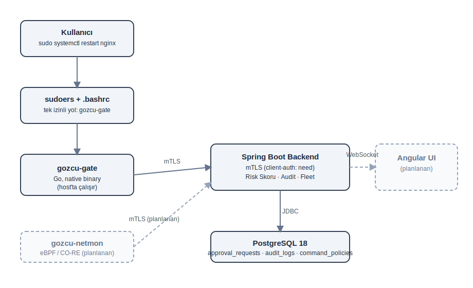
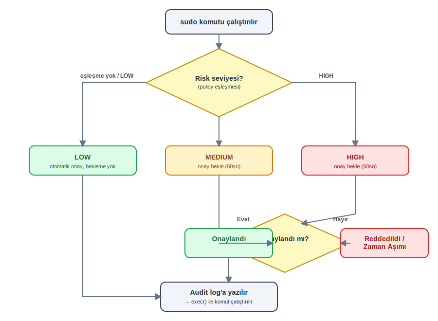

# Gözcü — İlk Savunma Hattı

Kritik sunucu komutlarını (`sudo` ve benzerleri) çalışmadan önce onaya bağlayan, açık kaynak DevOps güvenlik aracı.

> "Log tutmak yeterli değil, alarm üretmek yeterli değil — bazı işlemler için önce izin almak gerekir."

---

## Nedir?

Bir operasyon mühendisi `sudo systemctl restart nginx` yazar. Komut hemen çalışmaz — bir onay arayüzünde kart çıkar:

```
Yavuz Karan — Host: prod-db-01 — restart nginx? [YES] [NO]
```

Onaylanırsa komut devam eder, reddedilirse hiçbir şey olmaz. Tüm süreç audit log'a düşer.

Gözcü, **Imzala.app**'in (eIDAS/PKI uyumlu dijital imza platformu) ikinci versiyonu olarak; hem gerçek bir DevOps güvenlik problemini çözmek hem de PKI/mTLS, eBPF, dağıtık sistem desenleri üzerindeki bilgiyi tazelemek amacıyla geliştirilmektedir.

---

## Felsefe ve İş Modeli

Hibrit açık kaynak — **Sentry/Plausible modeli**: kod tamamen açık, self-host tamamen ücretsiz, hiçbir özellik kilitli değil. Gelir sadece managed cloud hosting hizmetinden. Gerekçe: Gözcü'nün değeri güven üzerine kurulu; özellik kilitlemek bu güveni kırar.

---

## Mimari



<details>
<summary>ASCII şema (görsel yüklenmezse)</summary>

```
┌─────────────┐      mTLS      ┌──────────────────┐
│ gozcu-gate   │ ─────────────▶ │  Spring Boot      │
│ (Go, sudoers)│ ◀───────────── │  Backend (mTLS)   │
└─────────────┘                └──────────────────┘
                                         │
                                         ▼
                                  ┌─────────────┐
                                  │ PostgreSQL  │
                                  └─────────────┘
                                         ▲
                                         │ WebSocket (planlanan)
                                  ┌─────────────┐
                                  │  Angular UI  │
                                  └─────────────┘
```
</details>

| Bileşen | Teknoloji | Durum | Çalışma Yeri |
|---|---|---|---|
| Backend | Spring Boot 4.1 / Java 21 | ✅ Tamamlandı | Docker (VPS) |
| gozcu-gate | Go | ✅ Tamamlandı | Native binary (VPS, host) |
| mTLS (PKI) | OpenSSL, Java Keystore | ✅ Tamamlandı | — |
| gozcu-netmon | Go + eBPF/CO-RE + libbpf | ✅ Tamamlandı | Native binary (VPS, host) |
| Angular UI | Angular | 🔜 Planlandı | Docker (VPS) |

`gozcu-gate` ve `gozcu-netmon` container'lanmaz — sudoers entegrasyonu ve `exec()`/eBPF, host'un process/kernel namespace'ine bağımlı olduğu için native binary olarak host'ta çalışır.

---

## Temel Mimari Kararlar

**Komut yakalama:** PATH-wrapper yerine **sudoers + command wrapper** (gozcu-gate) — kullanıcıya sadece `gozcu-gate`'i çalıştırma izni verilir, hedef komutlara (`systemctl`, `rm` vb.) doğrudan sudo izni yoktur. Onay sonrası `exec()` ile gerçek binary'ye geçilir (PID korunur, audit doğal görünür).

**Bağlantı modeli:** İstek-bazlı HTTP/mTLS — ayrı bir daemon yönetimi (crash recovery, systemd) MVP'de gereksiz operasyonel yük.

**Onay bekleme mekanizması:** Hibrit — `DeferredResult` tabanlı 30 saniyelik bekleme, cevap gelmezse otomatik 2. round (30 sn daha). Toplam 60 saniye, anlık bildirim avantajı korunurken proxy/nginx timeout riski azaltılır.

**Komut eşleştirme:** Hibrit — önce tam eşleşme, yoksa wildcard (`systemctl restart *`) fallback'i.

**Risk skoru ve fallback davranışı:** Statik policy tablosu (LOW / MEDIUM / HIGH). Policy'de tanımlı olmayan komutlar **otomatik LOW** sayılır ve onay istemeden geçer — ama audit log'a yine de yazılır. Bu, günlük kullanımın sürtünmesiz kalmasını sağlarken hiçbir işlemin izsiz kalmamasını garanti eder.

---

## Risk Tabanlı Onay Akışı



<details>
<summary>ASCII şema (görsel yüklenmezse)</summary>

```
Komut çalıştırılır
       │
       ▼
Policy tablosunda eşleşme var mı?
       │
   ┌───┴────┐
  Hayır     Evet
   │          │
   ▼          ▼
  LOW    Tanımlı risk seviyesi
   │          │
   ▼          ▼
Otomatik   MEDIUM/HIGH ise
 onay      onay bekle (60sn)
   │          │
   └────┬─────┘
        ▼
   Audit log'a yazılır
        │
        ▼
   exec() ile komut çalışır
```
</details>

---

## Tehdit Modeli ve Sınırlamalar

Gözcü'nün koruma kapsamı **bilinçli olarak sınırlandırılmıştır.** Bu sınırlar, "eksiklik" değil, tasarım kararıdır:

**Korunan senaryo:** Normal bir kullanıcının `sudo` ile yetki yükseltme anı. Sudoers konfigürasyonu, kullanıcıya **sadece** `gozcu-gate`'i çalıştırma izni verir — `%sudo` grubu gibi genel/blanket bir sudo yetkisi kalmadığı sürece, gate **bypass edilemez.** Tam yol yazma, farklı shell kullanma, ortam değişkeni manipülasyonu — hiçbiri işe yaramaz, çünkü sudoers seviyesinde hedef komutlara hiç izin yoktur.

**Kapsam dışı (bilerek):** Kullanıcı zaten root yetkisine sahipse (root SSH key'i, fiziksel erişim, kernel exploit), gözcü'nün hiçbir etkisi yoktur. Bu, çözülebilecek bir problem değildir — root'u kısıtlamaya çalışmak "kobra etkisi" yaratır (sistemi kullanılamaz hale getirir veya daha tehlikeli atlatma yolları icat edilmesine sebep olur). Root'un yetkisiyle ne yapılacağı, sistem mühendisinin kendi tehdit modeline bırakılır.

**Sudoers bütünlüğü:** Bir kullanıcının yanlışlıkla `%sudo` grubuna geri eklenmesi ("drift") ihtimaline karşı, periyodik bir enforcement script'i (systemd timer) bu durumu otomatik tespit edip düzeltebilir.

**Fidye virüsleri (ransomware):** Gözcü, ayrıcalık yükseltme aşamasını kontrol eder, ancak dosya şifreleme genellikle root gerektirmeden, var olan yazma yetkisiyle gerçekleşir — bu, gözcü'nün kapsamı dışındadır. Gerçek koruma, **immutable/offsite backup** (örn. S3 Object Lock) ile sağlanır; Gözcü bunun yerini tutmaz.

---

## Teknoloji Yığını

- **Backend:** Java 21, Spring Boot 4.1, Spring Data JPA, PostgreSQL 18
- **Gate:** Go (statik binary, `CGO_ENABLED=0`)
- **Network Monitor:** Go + eBPF/CO-RE + libbpf-go (cilium/ebpf), BTF tabanlı kernel-bağımsız
- **Güvenlik:** mTLS (`client-auth: need`), kendi CA'sı ile imzalanmış sertifikalar
- **Deployment:** Docker (backend + postgres), native binary (gate + netmon)
- **Build/Deploy:** Gradle, Docker Hub

---

## Mevcut Durum

| Faz | İçerik | Durum |
|---|---|---|
| A | Spring Boot backend (Approval, Audit, Fleet, Policy) | ✅ |
| B | mTLS (CA, server/client sertifikaları) | ✅ |
| C | gozcu-gate (sudoers entegrasyonu, Go) | ✅ |
| D | gozcu-netmon (eBPF/CO-RE network monitor) | ✅ |
| E | Angular arayüzü | 🔜 |

**Canlı doğrulanan uçtan uca akışlar:**
- `sudo systemctl restart docker` → sudoers → gate → mTLS → backend → risk skoru → onay bekleme → uzaktan onay (curl) → `exec()` → gerçek komut çalışır → audit log
- `gozcu-netmon` → eBPF tracepoint hook → kernel ring buffer → Go user-space → PID/UID/process/hedef IP:port yakalama (Fedora 6.12'de derlenip Ubuntu 6.8'de CO-RE ile sorunsuz çalıştı)

---

## Vizyon (Gelecek Fazlar)

- **MITRE ATT&CK Entegrasyonu** — Policy tablosunun ATT&CK TTP'leriyle eşleştirilmesi (T1222, T1053, T1562, T1136, T1548...), threat intelligence'a dayalı policy yönetimi.
- **Tehdit Korelasyon Motoru** — Tek tek sudo olayları değil, zaman penceresi içindeki olay zincirleri analiz edilecek ("aynı kullanıcı 5 dakika içinde 3 MEDIUM risk komut denedi" tespiti).
- **Davranışsal Anomali Tespiti** — Her kullanıcı/host için normal davranış profili, baseline'dan sapmaların otomatik risk artışına yansıtılması.
- **Entegrasyon Ekosistemi** — Splunk, Elastic, CrowdStrike, SentinelOne entegrasyonu; Gözcü'yü mevcut MDR ekosistemiyle konuşan bir bileşene dönüştürmek.
- **Incident Response Desteği** — Aktif saldırı anında yarı-otomatik müdahale (host izolasyonu, kullanıcı kilitleme), playbook desteği.
- **Filesystem Activity Monitor** — eBPF ile dosya syscall izleme (openat/write/rename/unlink), toplu şifreleme paterni tespiti, canary/honeypot dosya tuzakları (tespit ve erken uyarı — engelleme değil).
- **Supply Chain Security** — Git repository izleme, paket bütünlük kontrolü, CI/CD anomali tespiti.
- **Seren Linux** — Gözcü'nün tüm güvenlik bileşenlerinin çekirdekte yerleşik geldiği, kullanıcı/grup yönetiminin dağıtımın kendisi tarafından dayatıldığı, sudoers yanlış konfigürasyonunun yapısal olarak mümkün olmadığı bir Linux dağıtımı. Güvenlik, sonradan eklenen bir katman değil — sistemin ve çekirdeğin bizzat kendisi. (.deb + .rpm desteği, Imzala.app entegrasyonu)

---

## Lisans

Açık kaynak — Sentry/Plausible modeli (self-host tamamen ücretsiz, tüm özellikler açık).
